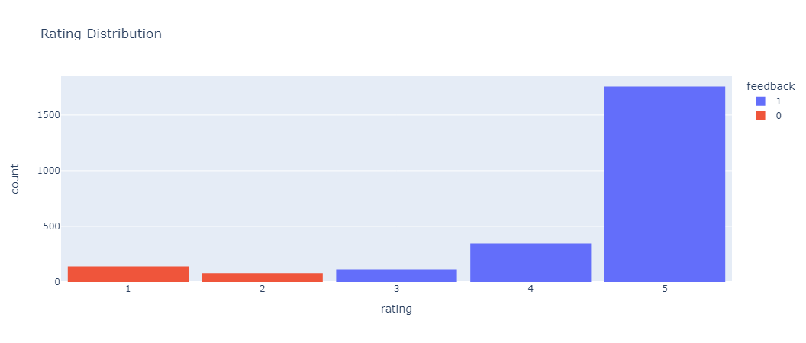
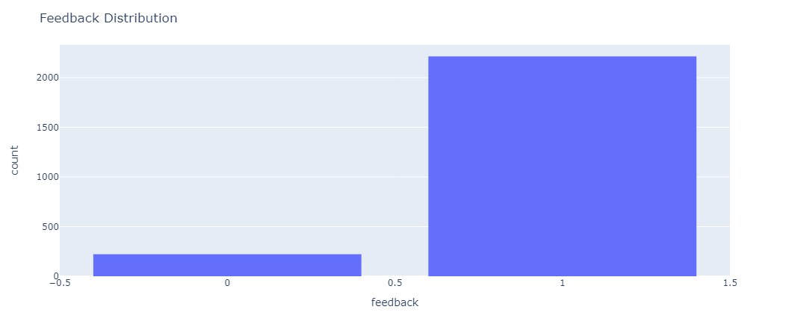
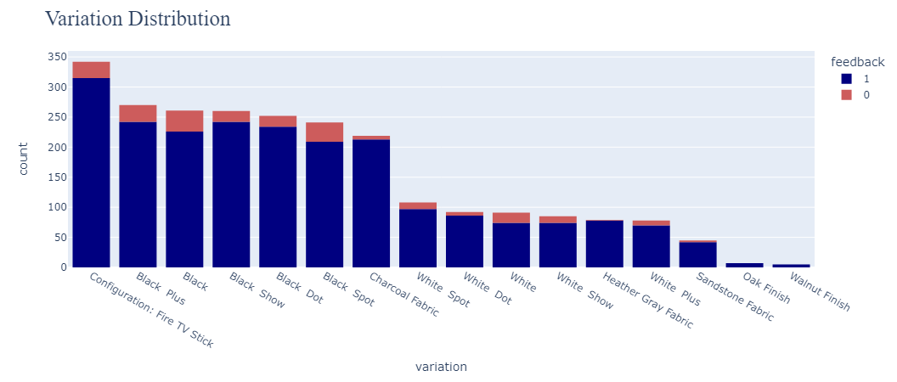
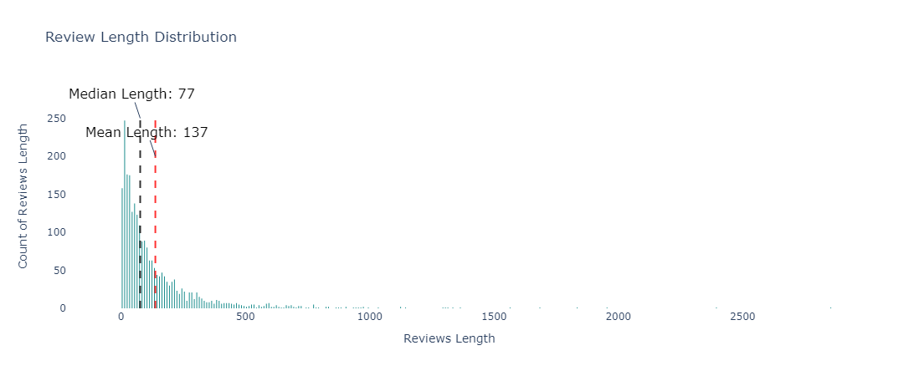
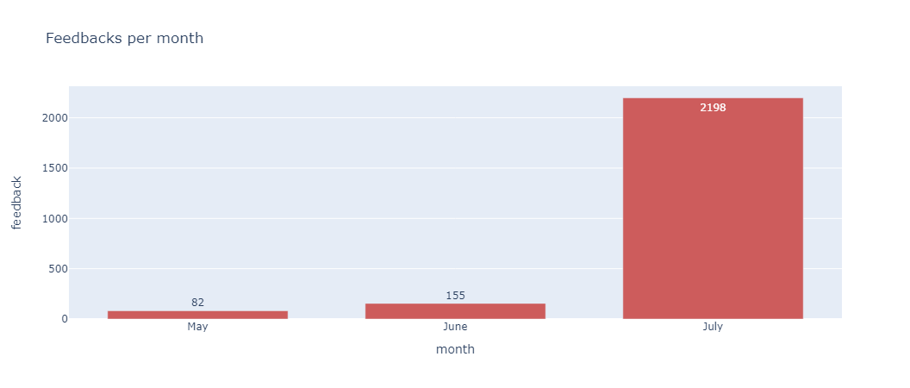

# Amazon Product Reviews Feedback

## Project Review
This data science project focuses on analyzing and extracting insights from Amazon product reviews to provide valuable feedback.
The goal is to develop a system that can automatically categorize and analyze customer reviews.

## Installation and Setup
### Code and Resources Used
- **Editor Used**: In this project I used Visual Studio Code with Jupyter Notebook extension.
- **Python Version**: 3.9 Python.
### Python Packages Used
- **General Purpose**: string, NTLK, Pickle and Joblib.
- **Data Manipulation**: Pandas, numpy, Category_encoders.
- **Data Visualization**: Plotly.
- **Machine Learning**: sklearn, xgboost, imblearn.

## Data
### Data Sample
**Rating:** 5 
| **Date:** 30-Jul-18 
| **Variation:** Black Dot
| **Verified_Reviews:** I have had the echo dot for about two weeks and ...
| **Feedback:** 1

### Data Exploration
- We found that date feature has a wrong type.
- We found around 715 duplicated rows and decided to drop them.
- No null values found in the data.
- We found that feedback = 1 when the rating is >= 3 otherwise the feedback is 0.

- We found imbalance in feedback (Our Target) feature.

- Variation Distribution.

- We found a skewness in the reviews column with a mean length = 137 and median length = 77.

### Data Preprocessing
- We fixed the Date column type by converting it to datetime.
- Grouped the date by month and found that July has by far the highest reviews.

- We used string library to remove punctuations from the reveiws as they don't have any value to us.
- We removed the stopwords ex. i, me, this, where ..etc using NTLK.
- Dropped the Unncessary Columns Date and ratings as rating has a high correlation with our target feature.
- Applying BinaryEncoder to variations column.
- Lemmatizing the reviews by using WordNetLemmatizer.
### Feature Extraction
- Applying TF-IDF Vectorizer to the reviews column.
- Applying SMOTE Technique on the Feedback column to resolve the imbalance problem.

## Results and Evaluation
### Logistic Regression Model 
- Applying logistic Regression model to the data by using StratifiedKFold with n-splits = 10
- It produced a 90.7% accuracy on training and 86.8% on testing.
- With f1-score on negative reveiws = 44% and 93% on positive reviews.

### XGBoost Model
- Applying XGBoost Classifier and using GridSearch to find the best parameters with cv = 5.
- It Produced a 90.1% accuracy on testing.
- With f1-score on negative reviews = 33% and on positive reviews = 95%.
  
## Code Structure
In this project I used the directory structure 
├── Docs__
│   ├── Diresctory Structure.rtf__
├── Data__
│   ├── amazon_alexa.tsv
│   ├── After_dropping_duplicates.pkl
│   ├── After_preprocessing.pkl
│   ├── After_ExtractingFeatures.pkl
├── NoteBooks
│   ├── 00 Exploration.ipynb
│   ├── 01 Preprocessing.ipynb
│   ├── 02 FeatureExtraction.ipynb
│   ├── 03 ModelCreation.ipynb
├── Images
│   ├── feedback.png
│   ├── feedbackPerMonth.png
│   ├── ratingPlot.png
│   ├── reviewsLength.png
│   ├── variations.png
│   ├── Amazon-Review-Analysis.png
├── Models
│   ├── logisticRegression_model.joblib
│   └── xgboost_model.joblib
└── README.md

